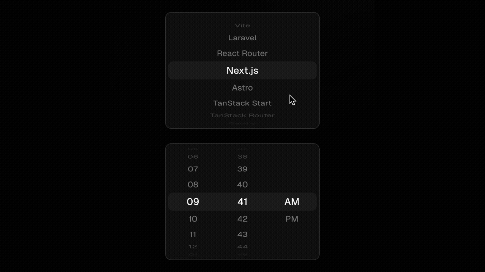

# [React Wheel Picker](https://react-wheel-picker.chanhdai.com) &middot;     

iOS-like wheel picker for React with smooth inertia scrolling and infinite loop support.

- 📱 Natural touch scrolling with smooth inertia effect
- 🖱️ Mouse drag and scroll support for desktop
- 🔄 Infinite loop scrolling
- 🎨 Unstyled components for complete style customization
- ⚡️ Easy installation via shadcn CLI

Check out the live demo: https://react-wheel-picker.chanhdai.com

## Documentation

Please read the [documentation](https://react-wheel-picker.chanhdai.com/docs/getting-started) for setup and API usage.

## Contributing

Please read the [contributing guide](/CONTRIBUTING.md).

## Contributors

> Made with [contrib.rocks](https://contrib.rocks)

## License

Licensed under the [MIT license](./LICENSE).

## Sponsors

This project is proudly supported by:

   

> Using this package at work? [Sponsor me](https://github.com/sponsors/ncdai) to help with support and maintenance.

## Star History

