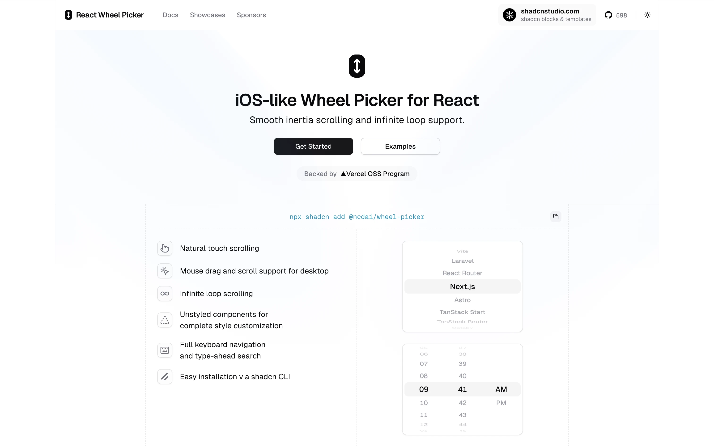

# [React Wheel Picker](https://react-wheel-picker.chanhdai.com)

  <a href="https://github.com/ncdai/react-wheel-picker"><picture><source media="(prefers-color-scheme: dark)" srcset="https://shieldcn.dev/github/ncdai/react-wheel-picker/license.svg?variant=outline&amp;font=geist" /></picture></a>
  <a href="https://www.npmjs.com/package/@ncdai/react-wheel-picker"><picture><source media="(prefers-color-scheme: dark)" srcset="https://shieldcn.dev/npm/@ncdai/react-wheel-picker.svg?variant=outline&amp;font=geist" /></picture></a>
  <a href="https://www.npmjs.com/package/@ncdai/react-wheel-picker"><picture><source media="(prefers-color-scheme: dark)" srcset="https://shieldcn.dev/npm/dw/@ncdai/react-wheel-picker.svg?variant=outline&amp;font=geist" /></picture></a>
  <a href="https://github.com/ncdai/react-wheel-picker/actions"><picture><source media="(prefers-color-scheme: dark)" srcset="https://shieldcn.dev/github/ncdai/react-wheel-picker/ci.svg?variant=outline&amp;font=geist" /></picture></a>
  <a href="https://github.com/ncdai/react-wheel-picker"><picture><source media="(prefers-color-scheme: dark)" srcset="https://shieldcn.dev/views/repo/ncdai/react-wheel-picker.svg?base=8541&amp;variant=outline&amp;font=geist" /></picture></a>

Backed by [▲Vercel OSS Program](https://vercel.com/blog/summer-2025-oss-program#react-wheel-picker)

iOS-like wheel picker for React with smooth inertia scrolling and infinite loop support.

- Natural touch scrolling with smooth inertia, mouse drag and scroll for desktop.
- Infinite loop scrolling.
- Unstyled core for complete style customization.
- Full keyboard navigation and type-ahead search.

→ Check out the live demo: https://react-wheel-picker.chanhdai.com

<a href="https://react-wheel-picker.chanhdai.com">
  <picture>
    <source media="(prefers-color-scheme: dark)" srcset=".github/screenshot-dark.webp" />
    
  </picture>
</a>

## Documentation

Please read the [documentation](https://react-wheel-picker.chanhdai.com/docs/getting-started) for setup and API usage.

## Contributing

Please read the [contributing guide](/CONTRIBUTING.md).

## Contributors

  <a href="https://github.com/ncdai/react-wheel-picker/graphs/contributors"><picture><source media="(prefers-color-scheme: dark)" srcset="https://shieldcn.dev/contributors/ncdai/react-wheel-picker.svg?title=false&amp;size=48&amp;align=left&amp;mode=dark&amp;font=geist&amp;watermark=true" /></picture></a>

## License

Licensed under the [MIT license](./LICENSE).

## Sponsors

This project is proudly supported by:

<table>
  <tbody>
    <tr>
      <td colspan="3"><strong>Open Source Program</strong></td>
    </tr>
    <tr>
      <td>
        <a href="https://vercel.com/blog/summer-2025-oss-program">
          <picture>
            <source
              media="(prefers-color-scheme: dark)"
              srcset="https://assets.chanhdai.com/images/sponsors/vercel-oss-program-2025-dark.svg"
            />
            
          </picture>
        </a>
      </td>
      <td>
        <a href="https://openpanel.dev/open-source?utm_source=react-wheel-picker">
          <picture>
            <source
              media="(prefers-color-scheme: dark)"
              srcset="https://assets.chanhdai.com/images/sponsors/openpanel-dark.svg"
            />
            
          </picture>
        </a>
      </td>
      <td>
        <a href="https://www.mintlify.com/oss-program?utm_source=react-wheel-picker">
          <picture>
            <source
              media="(prefers-color-scheme: dark)"
              srcset="https://assets.chanhdai.com/images/sponsors/mintlify-dark.svg"
            />
            
          </picture>
        </a>
      </td>
    </tr>
    <tr>
      <td colspan="3"><strong>Gold Sponsors</strong></td>
    </tr>
    <tr>
      <td>
        <a href="https://shadcnstudio.com?utm_source=chanhdai.com&utm_medium=banner&utm_campaign=github">
          <picture>
            <source
              media="(prefers-color-scheme: dark)"
              srcset="https://assets.chanhdai.com/images/sponsors/shadcnstudio-dark.svg"
            />
            
          </picture>
        </a>
      </td>
      <td>
        <a href="https://shadcnspace.com">
          <picture>
            <source
              media="(prefers-color-scheme: dark)"
              srcset="https://assets.chanhdai.com/images/sponsors/shadcnspace-dark.svg"
            />
            
          </picture>
        </a>
      </td>
      <td></td>
    </tr>
    <tr>
      <td colspan="3"><strong>Silver Sponsors</strong></td>
    </tr>
    <tr>
      <td>
        <a href="https://shadcncraft.com?atp=ncdai&utm_source=react-wheel-picker">
          <picture>
            <source
              media="(prefers-color-scheme: dark)"
              srcset="https://assets.chanhdai.com/images/sponsors/shadcncraft-dark.svg"
            />
            
          </picture>
        </a>
      </td>
      <td>
        <a href="https://www.shadcnblocks.com?via=ncdai&utm_source=react-wheel-picker">
          <picture>
            <source
              media="(prefers-color-scheme: dark)"
              srcset="https://assets.chanhdai.com/images/sponsors/shadcnblocks-dark.svg"
            />
            
          </picture>
        </a>
      </td>
      <td>
        <a href="https://reactbits.dev?utm_source=react-wheel-picker">
          <picture>
            <source
              media="(prefers-color-scheme: dark)"
              srcset="https://assets.chanhdai.com/images/sponsors/reactbits-dark.svg"
            />
            
          </picture>
        </a>
      </td>
    </tr>
    <tr>
      <td colspan="3"><strong>Spark Supporters</strong></td>
    </tr>
    <tr>
      <td>
        <a href="https://uirules.com?utm_source=react-wheel-picker">
          <picture>
            <source
              media="(prefers-color-scheme: dark)"
              srcset="https://assets.chanhdai.com/images/sponsors/uirules-dark.svg"
            />
            
          </picture>
        </a>
      </td>
      <td>
        <a href="https://shoogle.dev?utm_source=react-wheel-picker">
          <picture>
            <source
              media="(prefers-color-scheme: dark)"
              srcset="https://assets.chanhdai.com/images/sponsors/shoogle-dark.svg"
            />
            
          </picture>
        </a>
      </td>
      <td></td>
    </tr>
  </tbody>
</table>

> Using this package at work? [Sponsor me](https://github.com/sponsors/ncdai) to help with support and maintenance.

## Star history

  <picture><source media="(prefers-color-scheme: dark)" srcset="https://shieldcn.dev/chart/github/stars/ncdai/react-wheel-picker.svg?font=geist&amp;theme=cyan" /></picture>

